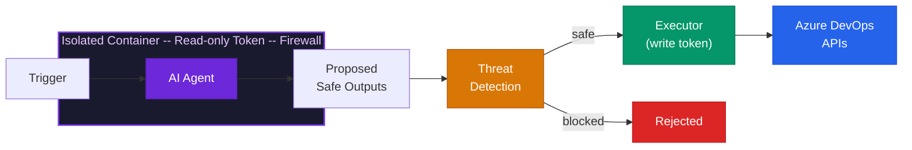

import { Card, CardGrid, Tabs, TabItem } from '@astrojs/starlight/components';

## What if your pipelines could think?

Write a markdown file. Describe what you want an AI agent to do -- in plain English. `ado-aw` compiles it into a production-grade Azure DevOps pipeline with **five layers of security** baked in.

Your agents run on a schedule or in response to events, proposing changes through **safe outputs** that are threat-scanned before anything touches your repositories.

```markdown
---
on:
  schedule: daily around 09:00
repos:
  - my-org/my-service
safe-outputs:
  create-pr:
    title-prefix: "[auto] "
    max: 1
---

## Dependency Guardian

Scan all package manifests for outdated or vulnerable dependencies.
For each finding, create a single pull request that bumps the version
and updates the lockfile. Include a summary of CVEs addressed.
```

---

## Wake up to results

<CardGrid>
  <Card title="Security patch PRs" icon="approve-check">
    Agents scan for CVEs overnight and open ready-to-merge pull requests by morning.
  </Card>
  <Card title="Pipeline failure analysis" icon="warning">
    When a build breaks, an agent reads the logs, identifies the root cause, and proposes a fix PR.
  </Card>
  <Card title="Documentation consistency" icon="document">
    Keep READMEs, changelogs, and API docs in sync with the code -- automatically.
  </Card>
  <Card title="Work item triage" icon="list-format">
    Stale issues get flagged, duplicates get linked, and priorities get suggested -- every day.
  </Card>
</CardGrid>

---

## Five security layers, zero trust

Every compiled pipeline enforces a defense-in-depth model. The agent **never** receives write credentials or secrets.



| Layer | What it does |
|-------|-------------|
| **Read-only token** | The agent can observe your repos but cannot push, merge, or delete anything |
| **Zero secrets** | Write tokens, API keys, and credentials exist only in the isolated executor stage |
| **Network firewall** | All outbound traffic routes through an allowlist-only proxy; everything else is dropped |
| **Safe outputs** | The agent proposes structured actions (PRs, comments, work items); hard limits and prefixes constrain what can be requested |
| **Threat detection** | A dedicated AI scan checks proposals for prompt injection, secret leaks, and malicious patterns before anything is applied |

---

## Define agents in markdown

No pipeline YAML to hand-write. No complex scripting. Just describe the agent's purpose in a markdown file with a YAML front-matter header for configuration.

<Tabs>
  <TabItem label="Agent file">
```markdown
---
on:
  schedule: weekly on monday around 10:00
engine:
  model: gpt-4.1
tools:
  bash: [grep, find, wc, jq]
safe-outputs:
  create-pr:
    title-prefix: "[docs] "
    max: 1
  comment-on-work-item:
---

## Documentation Sync

Review all public API surfaces and ensure the corresponding
docs are up to date. Open a PR with any corrections and
comment on related work items with a summary.
```
  </TabItem>
  <TabItem label="Compiled pipeline">
```yaml
# Auto-generated by ado-aw -- do not edit
trigger: none
schedules:
  - cron: "23 10 * * 1"
    branches:
      include: [main]
stages:
  - stage: Agent
    # Network-isolated sandbox, read-only token...
  - stage: Detection
    # AI threat scan of proposed outputs...
  - stage: Execution
    # Apply approved PRs and comments...
```
  </TabItem>
</Tabs>

---

## Get started in minutes

<CardGrid>
  <Card title="With Copilot agents" icon="rocket">
    Download `ado-aw`, run `ado-aw init`, then co-create your first agent interactively with `/agent ado-aw`.

    [Quick start with agents](/ado-aw/setup/quick-start/#with-agents-recommended)
  </Card>
  <Card title="Write it by hand" icon="pencil">
    Author an agent markdown file, compile it, push, and configure your Azure DevOps project.

    [Manual quick start](/ado-aw/setup/quick-start/#manual)
  </Card>
</CardGrid>

---

<div style="text-align: center; opacity: 0.7; font-size: 0.9rem; margin-top: 2rem;">

Built by [GitHub Next](https://githubnext.com) and Microsoft Research. Inspired by [GitHub Agentic Workflows](https://github.github.com/gh-aw/).

</div>
