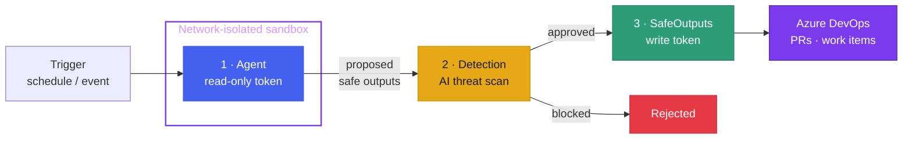

<div class="aw-aurora" style="height:100%; display:flex; flex-direction:column; justify-content:center; align-items:center;">

<div class="aw-pill">Azure DevOps Agentic Workflows</div>

<h1 style="font-size:3.4rem; line-height:1.05; margin-top:1.2rem;">
<span class="aw-gradient">Continuous AI</span><br/>for Azure DevOps
</h1>

<p class="aw-muted" style="font-size:1.1rem; margin-top:0.6rem;">
Author agents in markdown. Compile to safe ADO pipelines. <strong style="color:var(--aw-text)">ado-aw</strong>.
</p>

</div>

<!--
3-4 minute talk. Hook: the work your pipelines already do, but with an agent reasoning on top.
-->

---
layout: default
---

## CI/CD: the rung we already trust

CI/CD quietly became core infrastructure. We rely on it because it is:

<div class="aw-cards" style="margin-top:1.4rem;">
  <div class="aw-card">
    <div class="t">Async</div>
    <div class="d">It runs without us watching — work happens while we do other things.</div>
  </div>
  <div class="aw-card">
    <div class="t">Triggered</div>
    <div class="d">On a push, a PR, a schedule. Events fire it; humans don't babysit it.</div>
  </div>
  <div class="aw-card">
    <div class="t">Runs on shared runners</div>
    <div class="d">Existing pools and agents do the work — no new infrastructure to stand up.</div>
  </div>
  <div class="aw-card">
    <div class="t">Reliable & repeatable</div>
    <div class="d">Same inputs, same steps, predictable outputs every time.</div>
  </div>
</div>

<p class="aw-muted" style="margin-top:1.2rem;">It's the foundation. So what's the next rung?</p>

---
layout: default
---

## The next rung: Continuous AI

Swap deterministic scripts for an **agent that reasons** — and keep everything that made CI/CD work.

<div class="aw-map">
  <div class="col">
    <div class="ico">⏳</div>
    <div class="k">Async</div>
    <div class="v">Agents work overnight. Results are waiting by morning.</div>
  </div>
  <div class="col">
    <div class="ico">⚡</div>
    <div class="k">Triggered</div>
    <div class="v">Schedules and events kick off agents — same triggers you already use.</div>
  </div>
  <div class="col">
    <div class="ico">🏗️</div>
    <div class="k">Existing runners</div>
    <div class="v">Runs on your current pipeline agents. No new platform.</div>
  </div>
</div>

<p style="text-align:center; margin-top:1.6rem; font-size:1.15rem;">
Same operational model. <span class="aw-gradient" style="font-weight:700;">Agents instead of scripts.</span>
</p>

<!--
The mapping is the whole pitch: CAI is CI/CD with a reasoning step. If you have CI/CD, you already have the substrate.
-->

---
layout: default
---

## ado-aw: a platform for Continuous AI

You describe the agent in **markdown**; `ado-aw` compiles it into a secure **Azure DevOps pipeline**.

<div class="grid grid-cols-2 gap-5 mt-3" style="align-items:start;">

<div>
<div class="aw-codelabel">📝 agent.md <span class="aw-muted">— what you write</span></div>

```markdown
---
on:
  schedule: weekly on monday around 10:00
permissions:
  write: my-write-arm-connection
safe-outputs:
  create-pull-request:
    max: 1
---

## Documentation Sync

Review all public APIs and ensure the docs
are up to date. Open a PR with corrections.
```
</div>

<div>
<div class="aw-codelabel">⚙️ pipeline.yml <span class="aw-muted">— what ado-aw emits</span></div>

```yaml
# Auto-generated by ado-aw -- do not edit
trigger: none
schedules:
  - cron: "23 10 * * 1"
    branches:
      include: [main]
stages:
  - stage: Agent          # isolated sandbox,
                          # read-only token
  - stage: Detection      # AI threat scan
  - stage: SafeOutputs    # apply approved PRs
```
</div>

</div>

<div class="text-center aw-muted mt-3">
One <code>ado-aw compile</code> &nbsp;→&nbsp; a secure, three-stage pipeline ready to run on your existing pools.
</div>

---
layout: default
---

## Key principles

<div class="aw-cards">
  <div class="aw-card">
    <div class="t">📝 Markdown-first authoring</div>
    <div class="d">Intent lives in readable markdown — easy to review, edit, and generate with AI.</div>
  </div>
  <div class="aw-card">
    <div class="t">🛡️ Safe outputs, not direct writes</div>
    <div class="d">The agent proposes structured actions (PRs, comments, work items). Limits and prefixes constrain them.</div>
  </div>
  <div class="aw-card">
    <div class="t">🌐 Network isolation</div>
    <div class="d">The agent runs in a sandbox with an allowlist-only firewall and a read-only token.</div>
  </div>
  <div class="aw-card">
    <div class="t">🔎 Threat detection</div>
    <div class="d">A dedicated scan checks every proposal for injection and secret leaks before anything is applied.</div>
  </div>
  <div class="aw-card">
    <div class="t">🧩 Reuse existing pipelines</div>
    <div class="d">Compile a stage-level template and slot continuous AI into pipelines you already trust.</div>
  </div>
  <div class="aw-card">
    <div class="t">♻️ Same model as gh-aw</div>
    <div class="d">Same markdown format and security architecture as GitHub Agentic Workflows — for Azure DevOps.</div>
  </div>
</div>

---
layout: default
---

## How it works: three stages, zero trust

The agent **never** receives write credentials. Reasoning and mutation stay separated.



<p class="aw-muted text-center" style="margin-top:0.6rem;">
Author once in markdown → compile to the pipeline → runtime enforces the boundaries.
</p>

---
layout: center
class: text-center
---

<div class="aw-aurora" style="height:100%; display:flex; flex-direction:column; justify-content:center; align-items:center;">

<h1 style="font-size:2.6rem;">Wake up to <span class="aw-gradient">results</span></h1>

<p class="aw-muted" style="font-size:1.05rem; max-width:34rem; margin-top:0.6rem;">
Patched vulnerabilities. Synced docs. Diagnosed builds. Proposed, reviewed, and ready to merge — before you open your laptop.
</p>

```bash
ado-aw init        # scaffold your project
/agent ado-aw      # co-create your first agent
```

<div style="margin-top:1.4rem;" class="aw-muted">
github.com/githubnext/ado-aw&nbsp;&nbsp;·&nbsp;&nbsp;githubnext.github.io/ado-aw
</div>

</div>
