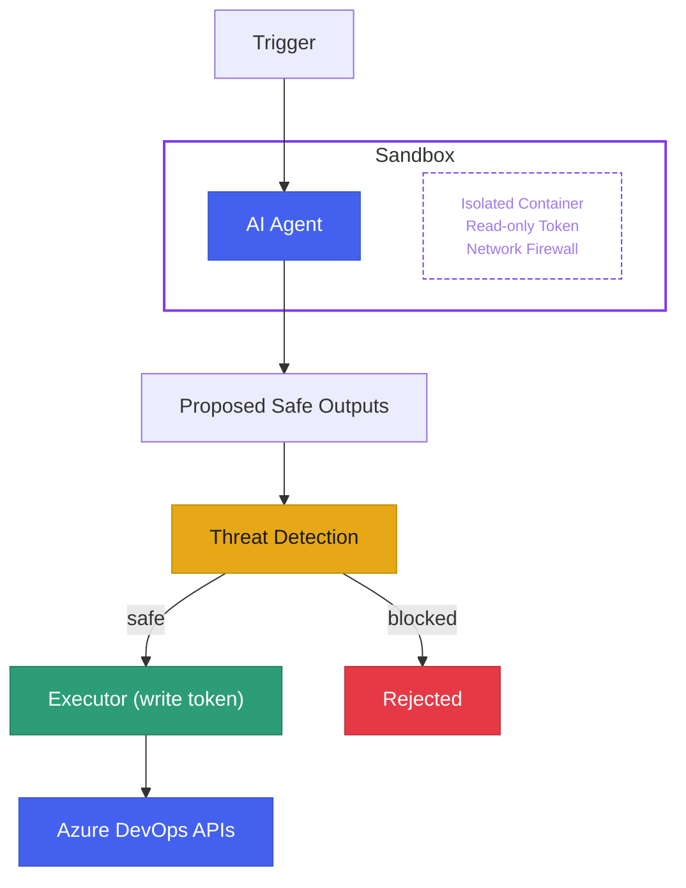

import { Card, CardGrid, Tabs, TabItem } from '@astrojs/starlight/components';
import CompilePreview from '../../components/CompilePreview.astro';

## Define agents in markdown

No pipeline YAML to hand-write. No complex scripting. Just describe the agent's purpose in a markdown file with a YAML front-matter header for configuration.

<CompilePreview>
  <Fragment slot="source">
```markdown
---
on:
  schedule: weekly on monday around 10:00
permissions:
  write: my-write-arm-connection
safe-outputs:
  create-pull-request:
    title-prefix: "[docs] "
    max: 1
---

## Documentation Sync

Review all public API surfaces and ensure the corresponding
docs are up to date. Open a PR with any corrections.
```
  </Fragment>
  <Fragment slot="output">
```yaml
# Auto-generated by ado-aw -- do not edit
trigger: none
schedules:
  - cron: "23 10 * * 1"
    branches:
      include: [main]
stages:
  - stage: Agent
    # Network-isolated sandbox, read-only token...
  - stage: Detection
    # AI threat scan of proposed outputs...
  - stage: SafeOutputs
    # Apply approved PRs and comments...
```
  </Fragment>
</CompilePreview>

Vulnerabilities patched. Docs updated. Broken builds diagnosed and fixed. By the time you open your laptop, agents have already done the work -- proposed, reviewed, and ready to merge.

---

## Wake up to results

<CardGrid>
  <Card title="Security patch PRs" icon="approve-check">
    Agents scan for CVEs overnight and open ready-to-merge pull requests by morning.
  </Card>
  <Card title="Pipeline failure analysis" icon="warning">
    When a build breaks, an agent reads the logs, identifies the root cause, and proposes a fix PR.
  </Card>
  <Card title="Documentation consistency" icon="document">
    Keep READMEs, changelogs, and API docs in sync with the code -- automatically.
  </Card>
  <Card title="Work item triage" icon="list-format">
    Stale issues get flagged, duplicates get linked, and priorities get suggested -- every day.
  </Card>
</CardGrid>

---

## Five security layers, zero trust

Every compiled pipeline enforces a defense-in-depth model. The agent **never** receives write credentials or secrets.



| Layer | What it does |
|-------|-------------|
| **Read-only token** | The agent can observe your repos but cannot push, merge, or delete anything |
| **Zero secrets** | Write tokens, API keys, and credentials exist only in the isolated executor stage |
| **Network firewall** | All outbound traffic routes through an allowlist-only proxy; everything else is dropped |
| **Safe outputs** | The agent proposes structured actions (PRs, comments, work items); hard limits and prefixes constrain what can be requested |
| **Threat detection** | A dedicated AI scan checks proposals for prompt injection, secret leaks, and malicious patterns before anything is applied |

---

## Augment your existing pipelines

Already have Azure DevOps pipelines you rely on? You don't have to start from scratch. Compile an agent with `target: stage` and ado-aw emits a reusable, stage-level template you can drop straight into an existing multi-stage pipeline -- no rewrites required.

```yaml
stages:
  - stage: Build
    jobs: ...
  - template: agents/review.lock.yml   # the agentic workflow, slotted in
    parameters:
      dependsOn: Build
```

The same three-job security chain (Agent → Detection → SafeOutputs) runs as part of your current pipeline, so you can layer continuous AI onto the workflows you already trust. See [Target platforms](/ado-aw/reference/targets/) for details.

---

## Get started in minutes

<CardGrid>
  <Card title="With Copilot agents" icon="rocket">
    Download `ado-aw`, run `ado-aw init`, then co-create your first agent interactively with `/agent ado-aw`.

    [Quick start with agents](/ado-aw/setup/quick-start/#with-agents-recommended)
  </Card>
  <Card title="Write it by hand" icon="pencil">
    Author an agent markdown file, compile it, push, and configure your Azure DevOps project.

    [Manual quick start](/ado-aw/setup/quick-start/#manual)
  </Card>
</CardGrid>

---

## Same salad, different dressing

Familiar with [GitHub Agentic Workflows](https://github.github.com/gh-aw/)? Azure DevOps Agentic Workflows leverages the exact same technologies -- network-isolated sandboxes, safe outputs, threat detection, and MCP tooling -- with a specialized compiler that targets Azure DevOps Pipelines instead of GitHub Actions.

| | GitHub Agentic Workflows | Azure DevOps Agentic Workflows |
|---|---|---|
| **Platform** | GitHub Actions | Azure DevOps Pipelines |
| **Agent format** | Markdown + YAML front matter | Markdown + YAML front matter |
| **Security model** | Read-only token, AWF sandbox, safe outputs, threat detection | Read-only token, AWF sandbox, safe outputs, threat detection |
| **Compiler** | `gh aw compile` | `ado-aw compile` |
| **Safe outputs** | PRs, issues, labels, comments | PRs, work items, wiki pages, build tags |
| **MCP support** | GitHub MCP, custom servers | Azure DevOps MCP, GitHub MCP, custom servers |

If your team already writes `gh-aw` workflows, you already know how to write `ado-aw` agents. The markdown format, security architecture, and mental model are identical.

<div style="text-align: center; opacity: 0.7; font-size: 0.9rem; margin-top: 3rem;">

Inspired by [GitHub Agentic Workflows](https://github.github.com/gh-aw/).

</div>
