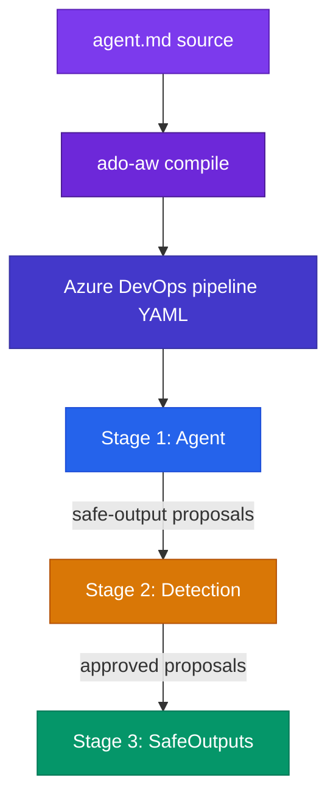

`ado-aw` takes a markdown agent file and turns it into an Azure DevOps pipeline that runs in three stages.

## The three-stage pipeline model

### 1. Agent

The first stage runs the AI agent inside a network-isolated sandbox with a read-only Azure DevOps token. The agent can inspect code, use its approved tools, and propose actions through safe outputs.

Importantly, the agent does **not** perform write actions directly.

### 2. Detection

The second stage reviews the agent's proposed outputs. Its job is to detect problems such as:

- prompt injection attempts
- secret leakage
- malformed or suspicious outputs
- policy violations

Only approved proposals continue to the next stage.

### 3. SafeOutputs

The third stage applies approved actions with a separate write-capable token. This stage can create or update Azure DevOps resources such as pull requests, comments, work items, and related artifacts.

Because the write credential is isolated from the agent, the system keeps a strong boundary between reasoning and mutation.

## Compile time vs. runtime

### At compile time

When you run `ado-aw compile`, the compiler:

- parses the markdown body and YAML front matter
- validates the configuration
- selects the target pipeline template
- injects runtime configuration for tools, runtimes, and safe outputs
- emits Azure DevOps YAML and supporting agent assets

### At runtime

When Azure DevOps executes the compiled pipeline, it:

- runs the agent with the configured tool set and permissions
- records proposed safe outputs
- analyzes those outputs for threats
- executes approved outputs with the final executor stage

## Flow diagram

The key idea is that authoring happens once in markdown, compilation produces the pipeline definition, and runtime execution enforces the safety boundaries.
