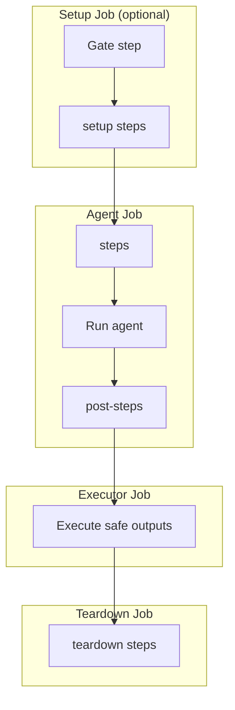

## Input Format (Markdown with Front Matter)

The compiler expects markdown files with YAML front matter similar to gh-aw:

```markdown
---
name: "name for this agent"
description: "One line description for this agent"
target: standalone # Optional: "standalone" (default), "1es", "job", or "stage". See docs/targets.md.
engine: copilot # Engine identifier. Defaults to copilot. Currently only 'copilot' (GitHub Copilot CLI) is supported.
# engine:                        # Alternative object format (with additional options)
#   id: copilot
#   model: claude-opus-4.7
#   timeout-minutes: 30
workspace: repo # Optional: "root", "repo" (alias: "self"), or a checked-out repository alias. If not specified, defaults to "root" when no additional repositories are listed in `repos:`, and to "repo" when one or more additional repos are checked out. See "Workspace Defaults" below.
pool:                          # Microsoft-hosted agent (default for standalone target)
  vmImage: ubuntu-22.04        # defaults to ubuntu-22.04 when pool is omitted entirely
# pool: MySelfHostedPool       # String form -- legacy shorthand for a self-hosted pool name
# pool:                        # Self-hosted pool object form
#   name: MySelfHostedPool
#   demands:                   # optional Azure Pipelines demands (not supported with vmImage)
#     - CustomCapability -equals required-value
# pool:                        # 1ES pool object form (set os: when needed)
#   name: AZS-1ES-L-MMS-ubuntu-22.04
#   os: linux                  # Operating system: "linux" or "windows". Defaults to "linux".
# pool:                        # Per-job pool overrides (not supported for target: 1es)
#   vmImage: ubuntu-22.04
#   overrides:                 # map of job name → pool config; unspecified jobs inherit the default pool
#     agent:
#       vmImage: ubuntu-22.04-gpu  # run the AI agent on a GPU pool
#     conclusion:
#       name: MySelfHostedPool
repos:                           # compact repository declarations (replaces repositories: + checkout:)
  - my-org/my-repo               # shorthand: alias="my-repo", type=git, ref=refs/heads/main, checkout=true
  - reponame=my-org/another-repo # shorthand with explicit alias
  - name: my-org/templates       # object form for full control
    ref: refs/heads/release/2.x
    checkout: false              # declared as resource only, not checked out by the agent
variable-groups:               # optional: import ADO Library variable groups into the pipeline
  - Agentic Workflows          # group display names only — secrets referenced by $(VAR_NAME) in steps
tools:                         # optional tool configuration
  bash: ["cat", "ls", "grep"]  # explicit bash allow-list; when omitted, all bash tools are allowed (unrestricted)
  edit: true                   # enable file editing tool (default: true)
  cache-memory: true           # persistent memory across runs (see docs/tools.md)
  # cache-memory:              # Alternative object format (with options)
  #   allowed-extensions: [.md, .json]
  azure-devops: true           # first-class ADO MCP integration (see docs/tools.md)
  # azure-devops:              # Alternative object format (with scoping)
  #   toolsets: [repos, wit]
  #   allowed: [wit_get_work_item]
  #   org: myorg
runtimes:                      # optional runtime configuration (language environments)
  lean: true                   # Lean 4 theorem prover (see docs/runtimes.md)
  # lean:                      # Alternative object format (with toolchain pinning)
  #   toolchain: "leanprover/lean4:v4.29.1"
  # python: true               # Python runtime -- auto-installs via UsePythonVersion@0 (see docs/runtimes.md)
  # python:                    # Alternative object format (pin version, configure internal feed)
  #   version: "3.12"
  #   feed-url: "https://pkgs.dev.azure.com/myorg/_packaging/myfeed/pypi/simple/"
  # node: true                 # Node.js runtime -- auto-installs via UseNode@1 (see docs/runtimes.md)
  # node:                      # Alternative object format (pin version, configure internal feed)
  #   version: "22.x"
  #   feed-url: "https://pkgs.dev.azure.com/ORG/PROJECT/_packaging/FEED/npm/registry/"
  # dotnet: true               # .NET runtime -- auto-installs via UseDotNet@2 (see docs/runtimes.md)
  # dotnet:                    # Alternative object format (pin version, configure internal feed via nuget.config)
  #   version: "8.0.x"          # use "global.json" to pin from the repo's global.json
  #   feed-url: "https://pkgs.dev.azure.com/myorg/_packaging/myfeed/nuget/v3/index.json"
# env:                          # RESERVED: workflow-level environment variables (field exists but not yet used by compiler)
#   CUSTOM_VAR: "value"        # For now, use engine.env or mcp-servers.<name>.env for process-specific vars
# inlined-imports: false        # When true, resolve {{#runtime-import ...}} markers at compile time
#                               # (default: false -- markers are resolved at pipeline runtime, so
#                               # prompt-body edits do not require recompilation).
#                               # See the Inlined Imports section below for details.
mcp-servers:
  my-custom-tool:              # containerized MCP server (requires container field)
    container: "node:20-slim"
    entrypoint: "node"
    entrypoint-args: ["path/to/mcp-server.js"]
    allowed:
      - custom_function_1
      - custom_function_2
safe-outputs:                  # optional per-tool configuration for safe outputs
  create-work-item:
    work-item-type: Task
    assignee: "user@example.com"
    tags:
      - automated
      - agent-created
    artifact-link:             # optional: link work item to repository branch
      enabled: true
      branch: main
on:                            # trigger configuration (unified under on: key)
  schedule: daily around 14:00 # fuzzy schedule - see docs/schedule-syntax.md
  pipeline:
    name: "Build Pipeline"     # source pipeline name
    project: "OtherProject"    # optional: project name if different
    branches:                  # optional: branches to trigger on
      - main
      - release/*
    filters:                   # optional runtime filters (compiled to gate step)
      source-pipeline: "Build*" # glob match on upstream pipeline name (Build.TriggeredBy.DefinitionName)
      branch: "refs/heads/main" # glob match on triggering branch (Build.SourceBranch)
      time-window:
        start: "09:00"
        end: "17:00"
      build-reason:
        include: [IndividualCI]  # only run when triggered by a commit push (not a schedule)
        exclude: [Schedule]
      expression: "eq(variables['Custom.Flag'], 'true')"  # raw ADO condition escape hatch
  pr:                          # PR trigger
    branches:
      include: [main]
    paths:
      include: [src/*]
    filters:                   # runtime PR filters (compiled to gate step)
      title: "*[review]*"
      author:
        include: ["alice@corp.com"]
      draft: false
      labels:
        any-of: ["run-agent"]
      source-branch: "feature/*"
      target-branch: "main"
      commit-message: "*[skip-agent]*"
      changed-files:
        include: ["src/**/*.rs"]
      min-changes: 5
      max-changes: 100
      time-window:
        start: "09:00"
        end: "17:00"
      build-reason:
        include: [PullRequest]
      expression: "eq(variables['Custom.Flag'], 'true')"  # raw ADO condition
steps:                         # inline steps before agent runs (same job, generate context)
  - bash: echo "Preparing context for agent"
    displayName: "Prepare context"
post-steps:                    # inline steps after agent runs (same job, process artifacts)
  - bash: echo "Processing agent outputs"
    displayName: "Post-steps"
setup:                         # separate job BEFORE agentic task
  - bash: echo "Setup job step"
    displayName: "Setup step"
teardown:                      # separate job AFTER safe outputs processing
  - bash: echo "Teardown job step"
    displayName: "Teardown step"
network:                       # optional network policy (standalone target only)
  allowed:                       # allowed host patterns and/or ecosystem identifiers
    - python                   # ecosystem identifier -- expands to Python/PyPI domains
    - "*.mycompany.com"        # raw domain pattern
  blocked:                     # blocked host patterns or ecosystems (removes from allow list)
    - "evil.example.com"
permissions:                   # optional ADO access token configuration
  read: my-read-arm-connection   # ARM service connection for read-only ADO access (Stage 1 agent)
  write: my-write-arm-connection # ARM service connection for write ADO access (Stage 3 executor only)
parameters:                    # optional ADO runtime parameters (surfaced in UI when queuing a run)
  - name: clearMemory
    displayName: "Clear agent memory"
    type: boolean
    default: false
# execution-context:          # always-on PR diff precompute (see docs/execution-context.md)
#   enabled: true             # master switch; default: true
#   pr:
#     enabled: true           # default: true when on.pr is configured; set false to opt out
---


## Build and Test

Build the project and run all tests...
```

## Triggers (`on:`)

The `on:` field consolidates all trigger types under one key. Three
sub-fields are supported — `schedule`, `pipeline`, and `pr` — and any
combination of them is valid.

### `on.schedule` — recurring schedule

Runs the pipeline on a repeating schedule. Accepts a human-friendly fuzzy
expression:

```yaml
on:
  schedule: daily around 14:00
```

See the [Schedule Syntax guide](/ado-aw/guides/schedule-syntax/) for the
full expression syntax, timezones, scattering, and day-of-week forms.

When `schedule` is set and `on.pr` is not explicitly configured, the
compiler emits `trigger: none` and `pr: none` — the pipeline only runs on
schedule, not on code pushes or PRs.

### `on.pipeline` — pipeline completion trigger

Triggers the pipeline when another ADO pipeline finishes. Maps to an ADO
[`pipelines` resource](https://learn.microsoft.com/en-us/azure/devops/pipelines/yaml-schema/resources-pipelines-pipeline).

```yaml
on:
  pipeline:
    name: "Build Pipeline"       # source pipeline name (required)
    project: "OtherProject"      # only when in a different ADO project
    branches: [main, release/*]  # omit to trigger on any branch
    filters:                     # optional runtime gate — evaluated inside the Setup job
      source-pipeline: "Build*"  # glob on Build.TriggeredBy.DefinitionName
      branch: "refs/heads/main"  # glob on Build.SourceBranch
```

| Field | Required | Description |
|-------|----------|-------------|
| `name` | **Yes** | Source pipeline name; maps to `source:` in the generated `pipelines:` resource block |
| `project` | No | ADO project that owns the source pipeline; omit when both pipelines are in the same project |
| `branches` | No | Branch filter; empty list triggers on any branch completing |
| `filters` | No | Runtime gate filters evaluated inside the Setup job (see table below) |

**`on.pipeline.filters` fields:**

| Field | Type | Description |
|-------|------|-------------|
| `source-pipeline` | glob | Upstream pipeline name must match (`Build.TriggeredBy.DefinitionName`). Use `"Build*"` to match any pipeline whose name starts with `Build`. |
| `branch` | glob | Triggering branch ref must match (`Build.SourceBranch`). |
| `time-window.start` / `.end` | `HH:MM` | Only run during this UTC time window. |
| `build-reason.include` | list | Build reason must be in this list. Common values: `ResourceTrigger`, `Manual`. |
| `build-reason.exclude` | list | Build reason must NOT be in this list. |
| `expression` | ADO condition | Raw ADO condition applied to the Agent job `condition:` (not compiled to a gate step). |

When `pipeline` is set and `on.pr` is not configured, CI push triggers and
PR triggers are suppressed (`trigger: none`, `pr: none`).

### `on.pr` — pull request trigger

Triggers the pipeline on pull request events. Supports two independent
layers of filtering:

| Layer | Field | Evaluated | Effect on unmatched builds |
|-------|-------|-----------|---------------------------|
| Native ADO | `branches:`, `paths:` | By ADO, before the pipeline starts | Pipeline is not queued at all — no runner consumed |
| Runtime gate | `filters:` | Inside the Setup job, after the pipeline starts | Gate script self-cancels the build |

Use **native ADO filters** for broad exclusions (e.g. restrict to certain
target branches). Use **runtime gate filters** for conditions that require
runtime context: PR title pattern, author allowlist, label requirements,
changed-file globs, time windows, draft status, and more.

```yaml
on:
  pr:
    mode: synthetic              # synthetic (default) or policy — see below
    branches:
      include: [main, release/*]  # native ADO — only PRs targeting these branches
    paths:
      include: [src/*]            # native ADO — only PRs that touch these paths
    filters:                      # runtime gate — evaluated inside the Setup job
      title: "*[run-agent]*"
      draft: false
      labels:
        any-of: ["run-agent"]
      source-branch: "feature/*"
```

**`on.pr.filters` fields:**

| Field | Type | Description |
|-------|------|-------------|
| `title` | glob | PR title must match this glob pattern (e.g. `"*[run-agent]*"`). |
| `source-branch` | glob | Source branch ref must match (e.g. `"refs/heads/feature/*"` or `"feature/*"`). |
| `target-branch` | glob | Target branch ref must match (e.g. `"refs/heads/main"`). |
| `commit-message` | glob | Last commit message must match. |
| `draft` | boolean | `true` = only draft PRs; `false` = only non-draft PRs. |
| `author.include` | list | Author email must appear in this list. |
| `author.exclude` | list | Author email must NOT appear in this list. |
| `labels.any-of` | list | PR must have at least one of these labels. |
| `labels.all-of` | list | PR must have all of these labels. |
| `labels.none-of` | list | PR must NOT have any of these labels. |
| `changed-files.include` | list of globs | At least one changed file must match any pattern. |
| `changed-files.exclude` | list of globs | No changed file may match any pattern. |
| `min-changes` | integer | Minimum number of changed files (inclusive). |
| `max-changes` | integer | Maximum number of changed files (inclusive). |
| `time-window.start` / `.end` | `HH:MM` | Only run during this UTC time window. |
| `build-reason.include` | list | Build reason must be in this list. Common values: `PullRequest`, `BatchedCI`, `IndividualCI`, `Manual`. |
| `build-reason.exclude` | list | Build reason must NOT be in this list. |
| `expression` | ADO condition | Raw ADO condition applied to the Agent job `condition:` (not compiled to a gate step). |

All filter fields are optional and combined with AND semantics — every configured field must pass. `author`, `labels`, and `changed-files` require a REST API call to the ADO PR endpoint; use native ADO `branches:` / `paths:` for broad exclusions that don't need runtime context.

See the [Filter IR reference](/ado-aw/reference/filter-ir/) for compilation details and validation rules.

**`on.pr.mode`** — Controls how the pipeline queues PR builds:

| `mode` | CI `trigger:` | Use when |
|--------|---------------|----------|
| `synthetic` (default) | ADO default (all branches) | No Build Validation branch policy is installed. Setup synthesizes PR context from the ADO API. **Recommended for most agents.** |
| `policy` | `trigger: none` | Operator has installed an ADO Build Validation branch policy. Prevents duplicate CI builds. |

:::note[ADO Azure Repos behavior]
Azure DevOps ignores the YAML `pr:` block for **Azure Repos** repositories unless a [Build Validation branch policy](https://learn.microsoft.com/en-us/azure/devops/repos/git/branch-policies?view=azure-devops#build-validation) is registered server-side. Without one, every push fires as `Build.Reason = IndividualCI` even when a PR is open — PR-aware agents silently degrade.

`ado-aw` offers two strategies:

**`mode: synthetic` (default)** — fires the pipeline on every push (ADO `trigger:` at its default). A Setup-job step calls the ADO REST API to find an open PR for the pushed branch:
- **PR found** → promotes the build to PR semantics (`AW_SYNTHETIC_PR=true`), evaluates `filters:`, and stages `aw-context/pr/` context for the agent.
- **No PR found** → sets `AW_SYNTHETIC_PR_SKIP=true` and the Agent job self-skips cleanly — no noise, no red builds.

**`mode: policy`** — for when the operator has explicitly installed a Build Validation branch policy targeting this pipeline. The compiler emits `trigger: none` so pushes no longer queue duplicate CI builds alongside the policy-driven PR build. Every PR update fires exactly one `Build.Reason = PullRequest` build.
:::

### Trigger suppression

When `on.schedule` or `on.pipeline` is configured, the compiler emits
`trigger: none` and `pr: none` to prevent the pipeline from also firing on
every code push or PR. Setting `on.pr` explicitly re-enables the PR trigger
regardless of whether `schedule` or `pipeline` is also set.

| `on.schedule` | `on.pipeline` | `on.pr` | CI (push) | PR events |
|:---:|:---:|:---:|---|---|
| — | — | — | ADO default | ADO default |
| ✓ | — | — | `none` | `none` |
| — | ✓ | — | `none` | `none` |
| ✓ | ✓ | — | `none` | `none` |
| — | — | ✓ | ADO default | ✓ enabled |
| ✓ | — | ✓ | `none` | ✓ enabled |
| — | ✓ | ✓ | `none` | ✓ enabled |

## Workspace Defaults

The `workspace:` field controls which directory the agent runs in. When it is
not set explicitly, the compiler chooses a default based on which repositories
are checked out (entries in `repos:` with `checkout: true`, which is the
default):

- If no additional repositories are checked out (i.e. only the pipeline's own
  repository is checked out via the implicit `self`), `workspace:` defaults to
  **`root`** -- the agent runs in the pipeline's working directory root.
- If one or more additional repositories are checked out, `workspace:` defaults
  to **`repo`** -- the agent runs inside the trigger repository's directory.

Set `workspace:` explicitly to `root`, `repo` (alias `self`), or a specific
checked-out repository alias to override this behavior.

## Pool Configuration (`pool:`)

The `pool:` field selects the Azure Pipelines agent pool (and optionally the
image) that jobs run on. There are three supported forms:

```yaml
# Microsoft-hosted agent pool — vmImage shorthand
pool:
  vmImage: ubuntu-22.04          # ubuntu-22.04, windows-2022, macos-latest, ...

# Self-hosted pool by name
pool:
  name: MySelfHostedPool

# 1ES pool object form (required for target: 1es)
pool:
  name: AZS-1ES-L-MMS-ubuntu-22.04
  os: linux                      # "linux" or "windows". Defaults to "linux".
```

The legacy bare-string form (`pool: MySelfHostedPool`) is still accepted at
parse time and is automatically normalized to `pool: { name: ... }` by a
compiler codemod.

### Named pool demands

Self-hosted pools support [Azure Pipelines
demands](https://learn.microsoft.com/en-us/azure/devops/pipelines/process/demands)
to require specific agent capabilities. Demands cannot be used with `vmImage`.

```yaml
pool:
  name: MySelfHostedPool
  demands:
    - CustomCapability -equals required-value
    - Agent.OS -equals Linux
```

### Per-job pool overrides (`pool.overrides`)

By default every job in the compiled pipeline uses the same pool.
`pool.overrides` lets you assign a different pool to specific jobs — for
example, to run the Agent job on a GPU-equipped Linux pool while the rest of
the pipeline uses a standard Windows image:

```yaml
pool:
  vmImage: windows-2022          # default pool for all jobs
  overrides:
    agent:
      vmImage: ubuntu-22.04      # Agent job runs on Linux
    conclusion:
      name: MySelfHostedPool     # Conclusion job runs on a self-hosted pool
```

**Valid job keys** for `overrides`:

| Key | Job |
|-----|-----|
| `setup` | Pre-agent setup job |
| `agent` | Stage 1 — the AI agent |
| `detection` | Stage 2 — threat analysis |
| `safe-outputs` | Stage 3 — safe output executor |
| `safe-outputs-reviewed` | Stage 3 gated variant (when `require-approval` is set) |
| `teardown` | Post-executor teardown job |
| `conclusion` | Conclusion job (requires `safe-outputs:` to be configured) |

`manual-review` is always rejected — it is an agentless job fixed to
`pool: server`.

`pool.overrides` is not supported for `target: 1es`; specifying it there
is a compile-time error.

## Repositories (`repos:`)

The `repos:` field provides a compact way to declare additional repository
resources and control which ones the agent checks out. It replaces the legacy
`repositories:` + `checkout:` pair.

Each entry can be:

| Form | Syntax | Description |
|------|--------|-------------|
| **Shorthand** | `- org/repo` | Alias derived from last segment, type=git, ref=refs/heads/main, checkout=true |
| **Shorthand with alias** | `- alias=org/repo` | Explicit alias before `=` |
| **Object** | `- name: org/repo` | Full control over all fields |

Object fields:

| Field         | Default                | Description |
|---------------|------------------------|-------------|
| `name`        | *(required)*           | Full `org/repo` name (maps to ADO `name:`) |
| `alias`       | last segment of `name` | Repository alias (maps to ADO `repository:`) |
| `type`        | `git`                  | ADO repository resource type |
| `ref`         | `refs/heads/main`      | Branch or tag reference |
| `checkout`    | `true`                 | Whether the agent job clones this repo |
| `fetch-depth` | *(ADO default)*        | Shallow-clone depth (ADO `fetchDepth`). `0` = full history. Omit to keep ADO default. |
| `fetch-tags`  | *(ADO default)*        | Whether to fetch git tags during checkout (ADO `fetchTags`). Omit to keep ADO default. |

### Tuning checkout fetch behavior

On large monorepos the checkout step can dominate the run. Azure DevOps can
apply a pipeline-level shallow-fetch setting (newer pipelines commonly use
depth 1), while tag syncing can also add substantial transfer. `fetch-depth`
and `fetch-tags` let source-controlled YAML override those settings per
repository:

```yaml
repos:
  - name: my-org/monorepo
    fetch-depth: 1      # shallow clone — only the tip commit
    fetch-tags: false   # skip the (often huge) tag fetch
```

- `fetch-depth: 0` explicitly emits `fetchDepth: 0`, disabling shallow fetch
  even when the pipeline UI is configured for depth 1. Full history can be
  very expensive in a large or old repository.
- Omitting a field keeps the ADO default — agents that don't opt in compile **unchanged**.
- Setting `fetch-depth`/`fetch-tags` on an entry with `checkout: false` has no effect
  (no checkout step is emitted for it); the compiler emits a warning.

#### Tuning the trigger repository (`self`)

The trigger repository is always checked out as `checkout: self` and does not
appear as a regular `repos:` entry. To tune its fetch behavior, add a reserved
entry whose `name` is exactly `self`:

```yaml
repos:
  - name: self
    fetch-depth: 1
    fetch-tags: false
```

A `self` entry contributes **only** fetch tuning — it does not declare an extra
repository resource or additional checkout step. The tuning applies to the
`checkout: self` step in every generated job (Setup, Agent, Detection,
SafeOutputs, Teardown). Because the tuning comes from source, the compiled lock
stays in sync and the runtime **"Verify pipeline integrity"** step keeps passing —
no need to hand-edit the lock or set `ado-aw-debug.skip-integrity: true`.

A `self` entry accepts only `fetch-depth` and `fetch-tags`; setting any other
field (`alias`, `type`, `ref`, `checkout`) is rejected at compile time.
A bare `self` entry with no fetch fields (e.g. `- name: self`) is a no-op.

### Examples

Three repos, all checked out (most common case):

```yaml
repos:
  - my-org/tools
  - my-org/schemas
  - my-org/docs
```

Mixed: two checked out, one resource-only (used by templates):

```yaml
repos:
  - my-org/tools
  - my-org/schemas
  - name: my-org/pipeline-templates
    checkout: false
```

Custom ref and explicit alias:

```yaml
repos:
  - name: my-org/docs
    alias: docs-v2
    ref: refs/heads/release/2.x
```

### Legacy syntax (auto-rewritten)

The legacy `repositories:` + `checkout:` fields are auto-converted to
`repos:` by the [`repos_unified` codemod](/ado-aw/reference/codemods/). On the next
`ado-aw compile`, any source that still uses the legacy fields is
rewritten in place to the new shape -- each `repositories:` entry
becomes a `repos:` entry, with `checkout: false` added for entries
that weren't listed under `checkout:`. Mixing the legacy fields with
an existing `repos:` block is rejected; pick one shape.

## Variable Groups (`variable-groups:`)

Import one or more Azure DevOps **variable groups** (ADO Library groups) into
the generated pipeline so a source-clean lock can reference secrets managed at
the project level — for example a GitHub App private key shared across many
pipelines:

```yaml
variable-groups:
  - Agentic Workflows
  - Shared Secrets
```

Each entry is the **display name** of a variable group. The compiler emits a
top-level `variables:` block with one `- group:` import per entry, preserving
declaration order:

```yaml
variables:
  - group: Agentic Workflows
  - group: Shared Secrets
```

Groups are merged in order when they define the same variable name — later
groups win on key collisions.

### Authorization and import are both required

In Azure DevOps two independent steps are needed before a group's variables
are available to a YAML pipeline run:

1. **Authorization** — the pipeline *definition* must be granted permission
   to use the group (done in the ADO Library UI, outside ado-aw).
2. **YAML import** — the pipeline *YAML* must explicitly pull the group in
   with `variables: - group: <name>`.

Authorization alone is not sufficient — without the YAML import the variables
are unavailable at runtime. `variable-groups:` provides the YAML import; you
still need to authorize the group on the pipeline definition itself.

### Names only — never values

Only group **names** belong in `variable-groups:`. ado-aw never resolves,
prints, logs, or serializes a group's variable values. Steps reference secrets
by macro (`$(VAR_NAME)`) exactly as before. For example, wiring a GitHub App
private key that lives inside a group:

```yaml
variable-groups:
  - Agentic Workflows
engine:
  id: copilot
  github-app-token:
    app-id: 1234567
    owner: octo-org
    private-key: AGENTIC_WORKFLOWS_GITHUB_APP_PRIVATE_KEY
```

Group names that contain ADO expressions (`${{`, `$(`, `$[`), pipeline
commands (`##vso[`, `##[`), the compiler's own template marker (`{{`), or
control characters are rejected at compile time. Leading or trailing whitespace
is also rejected — the name must match the ADO group display name exactly.

Duplicate entries are rejected. Variable group names are case-insensitive in
ADO, so `Shared Secrets` and `shared secrets` are treated as the same group;
remove the redundant entry.

### Target support

`variable-groups:` is only valid for pipeline-level targets — `standalone`
(default) and `1es`. Using it on `target: job` or `target: stage` is a
compile-time error: ADO job and stage templates cannot declare pipeline-level
`variables:` (the parent pipeline that includes the template owns them). Import
the group in that parent pipeline instead.

## Custom Steps Injection

The `steps`, `post-steps`, `setup`, and `teardown` fields let you inject custom ADO pipeline steps at specific points in the compiled workflow's execution flow.

### Execution Order

Custom steps are inserted at these points in the three-stage pipeline:



The Setup job is only created when `on:` filters or `setup:` steps are configured. When both are present, the gate step runs first — `setup:` steps are conditioned on the gate passing.

| Field | Job | Position | Use Cases |
|-------|-----|----------|-----------|
| `setup` | Setup (separate job) | **After** gate step (conditioned on gate when filters active) | Pre-flight checks, credentials setup, external service initialization |
| `steps` | Agent (inline) | **Before** agent runs | Generate context files, fetch external data, prepare workspace |
| `post-steps` | Agent (inline) | **After** agent completes | Process agent outputs, run validation, upload diagnostics |
| `teardown` | Teardown (separate job) | **After** safe outputs execute | Cleanup, notification, metrics collection |

### Field Types

All four fields accept ADO step arrays (YAML sequences). Each step can be any standard ADO task or script:

```yaml
steps:
  - bash: echo "Inline bash step"
    displayName: "Prepare context"
  - task: DownloadSecureFile@1
    inputs:
      secureFile: "config.json"
    displayName: "Fetch config"
```

### `steps:` — Pre-Agent Context Preparation

Runs **before** the agent in the same job. Use for generating context the agent needs:

```yaml
steps:
  - bash: |
      git log --oneline -10 > /tmp/recent-commits.txt
      echo "Recent commits prepared for agent review"
    displayName: "Generate commit history"
```

The agent can then read `/tmp/recent-commits.txt` when forming its response.

### `post-steps:` — Post-Agent Processing

Runs **after** the agent in the same job. Use for processing agent outputs or running validation:

```yaml
post-steps:
  - bash: |
      if [ -f agent-output.json ]; then
        jq . agent-output.json || echo "Invalid JSON produced by agent"
      fi
    displayName: "Validate agent output"
```

### `setup:` — Pre-Flight Setup Job

Runs in the **Setup job** (a separate job that executes before the Agent job). When `on:` filters are configured, the gate step runs first and `setup:` steps are automatically conditioned on the gate passing — they are skipped if the trigger doesn't match your filters. When no filters are configured, `setup:` steps run unconditionally. Use for pre-flight infrastructure or workspace preparation the agent job depends on:

```yaml
setup:
  - bash: |
      curl -X POST https://api.service.com/start-session \
        -H "Authorization: Bearer $TOKEN"
    displayName: "Initialize external service"
    env:
      TOKEN: $(ExternalServiceToken)
```

The Setup job (with `setup:` steps) always runs first, followed by Agent, then Executor, then Teardown.

### `teardown:` — Post-Execution Cleanup Job

Runs as a **separate job** after safe outputs execute. Use for cleanup, notifications, or metrics:

```yaml
teardown:
  - bash: |
      echo "Pipeline completed. Cleaning up resources."
      rm -rf /tmp/agent-workspace
    displayName: "Cleanup workspace"
```

Teardown steps run even if the agent or executor jobs fail (condition: `always()`).

### Job Conditions

- **`setup`** steps run unconditionally when no filters are configured; when `on:` filters are active, they are conditioned on the gate passing
- **`steps`** (inline pre-agent) run unconditionally within the Agent job
- **`post-steps`** run only if the agent job reaches that phase (condition: `always()` within the job)
- **`teardown`** runs unconditionally after the executor job completes (condition: `always()`)

### Example: Full Custom Steps Workflow

```yaml
---
name: "data-pipeline"
description: "Fetch, process, and report on external data"
on:
  schedule: daily around 06:00
pool:
  vmImage: ubuntu-22.04
setup:
  - bash: |
      curl -o /tmp/dataset.csv https://data.example.com/daily.csv
      echo "Dataset downloaded and ready"
    displayName: "Fetch external dataset"
steps:
  - bash: |
      wc -l /tmp/dataset.csv > /tmp/row-count.txt
      echo "Row count prepared for agent"
    displayName: "Generate dataset stats"
post-steps:
  - bash: |
      echo "Agent completed. Archiving results."
      tar -czf agent-results.tar.gz /tmp/agent-*.log
    displayName: "Archive logs"
  - task: PublishBuildArtifacts@1
    inputs:
      pathToPublish: "agent-results.tar.gz"
      artifactName: "results"
teardown:
  - bash: |
      curl -X POST https://webhooks.example.com/notify \
        -d '{"status":"complete","pipeline":"$(Build.DefinitionName)"}'
    displayName: "Send completion webhook"
---

## Data Pipeline Agent

Review the dataset statistics in `/tmp/row-count.txt`, process the data in
`/tmp/dataset.csv`, and summarize any anomalies or trends.
```

## Inlined Imports

The `inlined-imports:` field controls when `{{#runtime-import ...}}`
markers in the markdown body are resolved. It defaults to `false`.
See the [Runtime imports reference](/ado-aw/reference/runtime-imports/) for the full marker
syntax, path resolution rules, and runtime behavior.

When `inlined-imports: false` (the default), the compiler leaves runtime-import
markers to be resolved on the pipeline runner. Prompt-body edits do not require
recompiling the generated YAML — the pipeline fetches the latest prompt at
runtime automatically.

When `inlined-imports: true`, the compiler resolves all runtime-import
markers at compile time, including the implicit top-level marker that
normally reloads the body itself. The emitted YAML contains the fully
expanded prompt body, so the pipeline file is self-contained.

The trade-off is that the generated YAML is larger, and prompt-body
edits require `ado-aw compile` plus committing the updated pipeline
file.

## Filter Validation

The compiler validates filter configurations at compile time and will emit
errors for impossible or conflicting combinations:

| Condition | Severity | Message |
|-----------|----------|---------|
| `min-changes` > `max-changes` | Error | No PR can satisfy both constraints |
| `time-window.start` = `time-window.end` | Error | Zero-width window never matches |
| Same value in `author.include` and `author.exclude` | Error | Conflicting include/exclude |
| Same value in `build-reason.include` and `build-reason.exclude` | Error | Conflicting include/exclude |
| Label in both `labels.any-of` and `labels.none-of` | Error | Label both required and blocked |
| Label in both `labels.all-of` and `labels.none-of` | Error | Label both required and blocked |
| Empty `labels` filter (no any-of/all-of/none-of) | Warning | No label checks applied |

Errors cause compilation to fail. Fix the conflicting filter configuration
before recompiling.

## Filter Behavior Notes

### Time Windows

Time windows use **half-open intervals**: `[start, end)`. A window of
`start: "09:00", end: "17:00"` matches from 09:00 up to but **not
including** 17:00. A build triggered at exactly 17:00 UTC will not match.

Overnight windows are supported: `start: "22:00", end: "06:00"` matches
from 22:00 through midnight to 05:59.

All times are evaluated in **UTC**.

### Changed Files

The `changed-files` filter checks the list of files modified in the PR.
If the PR has no changed files (empty diff) and an `include` pattern is
set, the filter will not match. An exclude-only filter (no `include`)
with no changed files passes vacuously (no excluded files are present).

### Expression Escape Hatch

The `expression` field on `pr.filters` and `pipeline.filters` is an
**advanced, unsafe escape hatch**. Its value is inserted verbatim into
the Agent job's ADO `condition:` field. It can reference any ADO
pipeline variable, including secrets. The compiler validates against
`##vso[` injection and ADO compile-time template expressions (`${{`), but otherwise trusts the
value. Only use this if the built-in filters are insufficient.

### Pipeline Requirements

The filter gate step uses `System.AccessToken` for self-cancellation
(PATCH to the builds REST API) and PR metadata retrieval. This requires:

1. **"Allow scripts to access the OAuth token"** must be enabled on the
   pipeline definition in ADO (Project Settings -> Pipelines -> Settings).
2. The pipeline's build service account must have permission to cancel
   builds.

If the token is unavailable, the gate step logs a warning and the build
completes as "Succeeded" (with the agent job skipped via condition)
rather than "Cancelled".

## Execution Context

The `execution-context:` block controls the **always-on execution-context plugin**,
which stages trigger-specific context files under `aw-context/` before the agent
runs. Each contributor handles a different trigger type:

| Contributor | Default | What it stages |
|-------------|---------|----------------|
| `pr` | on when `on.pr` is set | Merge-base SHA, head SHA, diff stats; `git diff $BASE..$HEAD` ready to run |
| `workitem` | on when `pr` is active | Linked ADO work item titles, descriptions, acceptance criteria |
| `pr.checks` | off (opt in) | Build Validation results for the current PR head |
| `manual` | on when `parameters:` declared | Requestor identity, parameter snapshot |
| `pipeline` | on when `on.pipeline` is set | Upstream build metadata (status, run URL, trigger definition) |
| `ci-push` | off (opt in) | "Since last green build on this branch" diff context |
| `schedule` | off (opt in) | "Since last run of this pipeline" diff context |
| `repo` | off (opt in) | Branch, HEAD SHA, last release tag, commits-since-tag |

```yaml
execution-context:
  enabled: true  # master switch; default: true

  # --- auto-on contributors (activate based on your triggers) ---
  pr:
    enabled: true  # default: true when on.pr is configured
    checks:
      enabled: false  # opt in to stage PR build-validation results
  workitem:
    enabled: true  # default: true when pr contributor is active
    max-items: 5   # cap on linked WIs staged (default: 5)
  manual:
    enabled: true  # default: true when any parameters: block is declared
  pipeline:
    enabled: true  # default: true when on.pipeline is configured

  # --- opt-in contributors (off by default) ---
  ci-push:
    enabled: false  # set true for "since last green build" diff on CI push builds
  schedule:
    enabled: false  # set true for "since last run" diff on scheduled builds
  repo:
    enabled: false  # set true for branch, SHA, last release tag, commits-since-tag
    conventions: false  # also probe CODEOWNERS / CONTRIBUTING.md / AGENTS.md
```

When the block is omitted entirely, contributors activate automatically based on
your trigger configuration: `pr`, `workitem`, `manual`, and `pipeline` contributors
turn on when their respective `on.*` trigger is configured.

See the [Execution Context reference](/ado-aw/reference/execution-context/) for the
full agent-visible file layout, bash allow-list behavior, trust boundary, and
migration notes.
