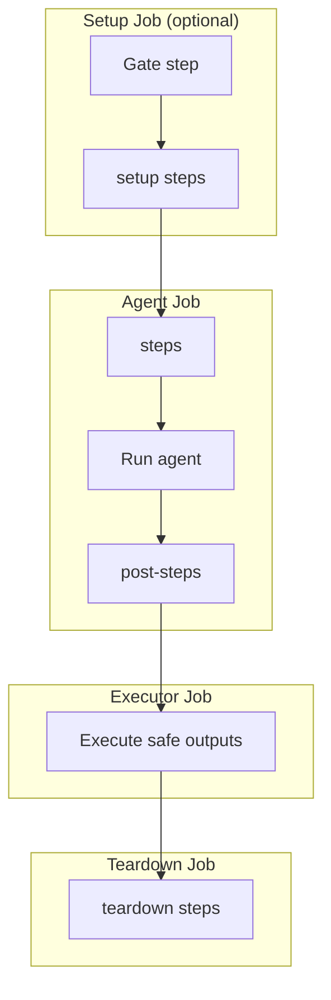

## Input Format (Markdown with Front Matter)

The compiler expects markdown files with YAML front matter similar to gh-aw:

```markdown
---
name: "name for this agent"
description: "One line description for this agent"
target: standalone # Optional: "standalone" (default), "1es", "job", or "stage". See docs/targets.md.
engine: copilot # Engine identifier. Defaults to copilot. Currently only 'copilot' (GitHub Copilot CLI) is supported.
# engine:                        # Alternative object format (with additional options)
#   id: copilot
#   model: claude-opus-4.7
#   timeout-minutes: 30
workspace: repo # Optional: "root", "repo" (alias: "self"), or a checked-out repository alias. If not specified, defaults to "root" when no additional repositories are listed in `repos:`, and to "repo" when one or more additional repos are checked out. See "Workspace Defaults" below.
pool:                          # Microsoft-hosted agent (default for standalone target)
  vmImage: ubuntu-22.04        # defaults to ubuntu-22.04 when pool is omitted entirely
# pool: MySelfHostedPool       # String form -- legacy shorthand for a self-hosted pool name
# pool:                        # Self-hosted pool object form
#   name: MySelfHostedPool
# pool:                        # 1ES pool object form (set os: when needed)
#   name: AZS-1ES-L-MMS-ubuntu-22.04
#   os: linux                  # Operating system: "linux" or "windows". Defaults to "linux".
repos:                           # compact repository declarations (replaces repositories: + checkout:)
  - my-org/my-repo               # shorthand: alias="my-repo", type=git, ref=refs/heads/main, checkout=true
  - reponame=my-org/another-repo # shorthand with explicit alias
  - name: my-org/templates       # object form for full control
    ref: refs/heads/release/2.x
    checkout: false              # declared as resource only, not checked out by the agent
tools:                         # optional tool configuration
  bash: ["cat", "ls", "grep"]  # explicit bash allow-list; when omitted, all bash tools are allowed (unrestricted)
  edit: true                   # enable file editing tool (default: true)
  cache-memory: true           # persistent memory across runs (see docs/tools.md)
  # cache-memory:              # Alternative object format (with options)
  #   allowed-extensions: [.md, .json]
  azure-devops: true           # first-class ADO MCP integration (see docs/tools.md)
  # azure-devops:              # Alternative object format (with scoping)
  #   toolsets: [repos, wit]
  #   allowed: [wit_get_work_item]
  #   org: myorg
runtimes:                      # optional runtime configuration (language environments)
  lean: true                   # Lean 4 theorem prover (see docs/runtimes.md)
  # lean:                      # Alternative object format (with toolchain pinning)
  #   toolchain: "leanprover/lean4:v4.29.1"
  # python: true               # Python runtime -- auto-installs via UsePythonVersion@0 (see docs/runtimes.md)
  # python:                    # Alternative object format (pin version, configure internal feed)
  #   version: "3.12"
  #   feed-url: "https://pkgs.dev.azure.com/myorg/_packaging/myfeed/pypi/simple/"
  # node: true                 # Node.js runtime -- auto-installs via NodeTool@0 (see docs/runtimes.md)
  # node:                      # Alternative object format (pin version, configure internal feed)
  #   version: "22.x"
  #   feed-url: "https://pkgs.dev.azure.com/ORG/PROJECT/_packaging/FEED/npm/registry/"
  # dotnet: true               # .NET runtime -- auto-installs via UseDotNet@2 (see docs/runtimes.md)
  # dotnet:                    # Alternative object format (pin version, configure internal feed via nuget.config)
  #   version: "8.0.x"          # use "global.json" to pin from the repo's global.json
  #   feed-url: "https://pkgs.dev.azure.com/myorg/_packaging/myfeed/nuget/v3/index.json"
# env:                          # RESERVED: workflow-level environment variables (field exists but not yet used by compiler)
#   CUSTOM_VAR: "value"        # For now, use engine.env or mcp-servers.<name>.env for process-specific vars
# inlined-imports: false        # When true, resolve {{#runtime-import ...}} markers at compile time
#                               # (default: false -- markers are resolved at pipeline runtime, so
#                               # prompt-body edits do not require recompilation).
#                               # See the Inlined Imports section below for details.
mcp-servers:
  my-custom-tool:              # containerized MCP server (requires container field)
    container: "node:20-slim"
    entrypoint: "node"
    entrypoint-args: ["path/to/mcp-server.js"]
    allowed:
      - custom_function_1
      - custom_function_2
safe-outputs:                  # optional per-tool configuration for safe outputs
  create-work-item:
    work-item-type: Task
    assignee: "user@example.com"
    tags:
      - automated
      - agent-created
    artifact-link:             # optional: link work item to repository branch
      enabled: true
      branch: main
on:                            # trigger configuration (unified under on: key)
  schedule: daily around 14:00 # fuzzy schedule - see docs/schedule-syntax.md
  pipeline:
    name: "Build Pipeline"     # source pipeline name
    project: "OtherProject"    # optional: project name if different
    branches:                  # optional: branches to trigger on
      - main
      - release/*
    filters:                   # optional runtime filters (compiled to gate step)
      source-pipeline: "Build*" # glob match on upstream pipeline name (Build.TriggeredBy.DefinitionName)
      branch: "refs/heads/main" # glob match on triggering branch (Build.SourceBranch)
      time-window:
        start: "09:00"
        end: "17:00"
      build-reason:
        include: [IndividualCI]  # only run when triggered by a commit push (not a schedule)
        exclude: [Schedule]
      expression: "eq(variables['Custom.Flag'], 'true')"  # raw ADO condition escape hatch
  pr:                          # PR trigger
    branches:
      include: [main]
    paths:
      include: [src/*]
    filters:                   # runtime PR filters (compiled to gate step)
      title: "*[review]*"
      author:
        include: ["alice@corp.com"]
      draft: false
      labels:
        any-of: ["run-agent"]
      source-branch: "feature/*"
      target-branch: "main"
      commit-message: "*[skip-agent]*"
      changed-files:
        include: ["src/**/*.rs"]
      min-changes: 5
      max-changes: 100
      time-window:
        start: "09:00"
        end: "17:00"
      build-reason:
        include: [PullRequest]
      expression: "eq(variables['Custom.Flag'], 'true')"  # raw ADO condition
steps:                         # inline steps before agent runs (same job, generate context)
  - bash: echo "Preparing context for agent"
    displayName: "Prepare context"
post-steps:                    # inline steps after agent runs (same job, process artifacts)
  - bash: echo "Processing agent outputs"
    displayName: "Post-steps"
setup:                         # separate job BEFORE agentic task
  - bash: echo "Setup job step"
    displayName: "Setup step"
teardown:                      # separate job AFTER safe outputs processing
  - bash: echo "Teardown job step"
    displayName: "Teardown step"
network:                       # optional network policy (standalone target only)
  allowed:                       # allowed host patterns and/or ecosystem identifiers
    - python                   # ecosystem identifier -- expands to Python/PyPI domains
    - "*.mycompany.com"        # raw domain pattern
  blocked:                     # blocked host patterns or ecosystems (removes from allow list)
    - "evil.example.com"
permissions:                   # optional ADO access token configuration
  read: my-read-arm-connection   # ARM service connection for read-only ADO access (Stage 1 agent)
  write: my-write-arm-connection # ARM service connection for write ADO access (Stage 3 executor only)
parameters:                    # optional ADO runtime parameters (surfaced in UI when queuing a run)
  - name: clearMemory
    displayName: "Clear agent memory"
    type: boolean
    default: false
---


## Build and Test

Build the project and run all tests...
```

## Workspace Defaults

The `workspace:` field controls which directory the agent runs in. When it is
not set explicitly, the compiler chooses a default based on which repositories
are checked out (entries in `repos:` with `checkout: true`, which is the
default):

- If no additional repositories are checked out (i.e. only the pipeline's own
  repository is checked out via the implicit `self`), `workspace:` defaults to
  **`root`** -- the agent runs in the pipeline's working directory root.
- If one or more additional repositories are checked out, `workspace:` defaults
  to **`repo`** -- the agent runs inside the trigger repository's directory.

Set `workspace:` explicitly to `root`, `repo` (alias `self`), or a specific
checked-out repository alias to override this behavior.

## Repositories (`repos:`)

The `repos:` field provides a compact way to declare additional repository
resources and control which ones the agent checks out. It replaces the legacy
`repositories:` + `checkout:` pair.

Each entry can be:

| Form | Syntax | Description |
|------|--------|-------------|
| **Shorthand** | `- org/repo` | Alias derived from last segment, type=git, ref=refs/heads/main, checkout=true |
| **Shorthand with alias** | `- alias=org/repo` | Explicit alias before `=` |
| **Object** | `- name: org/repo` | Full control over all fields |

Object fields:

| Field      | Default                | Description |
|------------|------------------------|-------------|
| `name`     | *(required)*           | Full `org/repo` name (maps to ADO `name:`) |
| `alias`    | last segment of `name` | Repository alias (maps to ADO `repository:`) |
| `type`     | `git`                  | ADO repository resource type |
| `ref`      | `refs/heads/main`      | Branch or tag reference |
| `checkout` | `true`                 | Whether the agent job clones this repo |

### Examples

Three repos, all checked out (most common case):

```yaml
repos:
  - my-org/tools
  - my-org/schemas
  - my-org/docs
```

Mixed: two checked out, one resource-only (used by templates):

```yaml
repos:
  - my-org/tools
  - my-org/schemas
  - name: my-org/pipeline-templates
    checkout: false
```

Custom ref and explicit alias:

```yaml
repos:
  - name: my-org/docs
    alias: docs-v2
    ref: refs/heads/release/2.x
```

### Legacy syntax (auto-rewritten)

The legacy `repositories:` + `checkout:` fields are auto-converted to
`repos:` by the [`repos_unified` codemod](/ado-aw/reference/codemods/). On the next
`ado-aw compile`, any source that still uses the legacy fields is
rewritten in place to the new shape -- each `repositories:` entry
becomes a `repos:` entry, with `checkout: false` added for entries
that weren't listed under `checkout:`. Mixing the legacy fields with
an existing `repos:` block is rejected; pick one shape.

## Custom Steps Injection

The `steps`, `post-steps`, `setup`, and `teardown` fields let you inject custom ADO pipeline steps at specific points in the compiled workflow's execution flow.

### Execution Order

Custom steps are inserted at these points in the three-stage pipeline:



The Setup job is only created when `on:` filters or `setup:` steps are configured. When both are present, the gate step runs first — `setup:` steps are conditioned on the gate passing.

| Field | Job | Position | Use Cases |
|-------|-----|----------|-----------|
| `setup` | Setup (separate job) | **After** gate step (conditioned on gate when filters active) | Pre-flight checks, credentials setup, external service initialization |
| `steps` | Agent (inline) | **Before** agent runs | Generate context files, fetch external data, prepare workspace |
| `post-steps` | Agent (inline) | **After** agent completes | Process agent outputs, run validation, upload diagnostics |
| `teardown` | Teardown (separate job) | **After** safe outputs execute | Cleanup, notification, metrics collection |

### Field Types

All four fields accept ADO step arrays (YAML sequences). Each step can be any standard ADO task or script:

```yaml
steps:
  - bash: echo "Inline bash step"
    displayName: "Prepare context"
  - task: DownloadSecureFile@1
    inputs:
      secureFile: "config.json"
    displayName: "Fetch config"
```

### `steps:` — Pre-Agent Context Preparation

Runs **before** the agent in the same job. Use for generating context the agent needs:

```yaml
steps:
  - bash: |
      git log --oneline -10 > /tmp/recent-commits.txt
      echo "Recent commits prepared for agent review"
    displayName: "Generate commit history"
```

The agent can then read `/tmp/recent-commits.txt` when forming its response.

### `post-steps:` — Post-Agent Processing

Runs **after** the agent in the same job. Use for processing agent outputs or running validation:

```yaml
post-steps:
  - bash: |
      if [ -f agent-output.json ]; then
        jq . agent-output.json || echo "Invalid JSON produced by agent"
      fi
    displayName: "Validate agent output"
```

### `setup:` — Pre-Flight Setup Job

Runs in the **Setup job** (a separate job that executes before the Agent job). When `on:` filters are configured, the gate step runs first and `setup:` steps are automatically conditioned on the gate passing — they are skipped if the trigger doesn't match your filters. When no filters are configured, `setup:` steps run unconditionally. Use for pre-flight infrastructure or workspace preparation the agent job depends on:

```yaml
setup:
  - bash: |
      curl -X POST https://api.service.com/start-session \
        -H "Authorization: Bearer $TOKEN"
    displayName: "Initialize external service"
    env:
      TOKEN: $(ExternalServiceToken)
```

The Setup job (with `setup:` steps) always runs first, followed by Agent, then Executor, then Teardown.

### `teardown:` — Post-Execution Cleanup Job

Runs as a **separate job** after safe outputs execute. Use for cleanup, notifications, or metrics:

```yaml
teardown:
  - bash: |
      echo "Pipeline completed. Cleaning up resources."
      rm -rf /tmp/agent-workspace
    displayName: "Cleanup workspace"
```

Teardown steps run even if the agent or executor jobs fail (condition: `always()`).

### Job Conditions

- **`setup`** steps run unconditionally when no filters are configured; when `on:` filters are active, they are conditioned on the gate passing
- **`steps`** (inline pre-agent) run unconditionally within the Agent job
- **`post-steps`** run only if the agent job reaches that phase (condition: `always()` within the job)
- **`teardown`** runs unconditionally after the executor job completes (condition: `always()`)

### Example: Full Custom Steps Workflow

```yaml
---
name: "data-pipeline"
description: "Fetch, process, and report on external data"
on:
  schedule: daily around 06:00
pool:
  vmImage: ubuntu-22.04
setup:
  - bash: |
      curl -o /tmp/dataset.csv https://data.example.com/daily.csv
      echo "Dataset downloaded and ready"
    displayName: "Fetch external dataset"
steps:
  - bash: |
      wc -l /tmp/dataset.csv > /tmp/row-count.txt
      echo "Row count prepared for agent"
    displayName: "Generate dataset stats"
post-steps:
  - bash: |
      echo "Agent completed. Archiving results."
      tar -czf agent-results.tar.gz /tmp/agent-*.log
    displayName: "Archive logs"
  - task: PublishBuildArtifacts@1
    inputs:
      pathToPublish: "agent-results.tar.gz"
      artifactName: "results"
teardown:
  - bash: |
      curl -X POST https://webhooks.example.com/notify \
        -d '{"status":"complete","pipeline":"$(Build.DefinitionName)"}'
    displayName: "Send completion webhook"
---

## Data Pipeline Agent

Review the dataset statistics in `/tmp/row-count.txt`, process the data in
`/tmp/dataset.csv`, and summarize any anomalies or trends.
```

## Inlined Imports

The `inlined-imports:` field controls when `{{#runtime-import ...}}`
markers in the markdown body are resolved. It defaults to `false`.
See the [Runtime imports reference](/ado-aw/reference/runtime-imports/) for the full marker
syntax, path resolution rules, and runtime behavior.

When `inlined-imports: false` (the default), the compiler leaves runtime-import
markers to be resolved on the pipeline runner. Prompt-body edits do not require
recompiling the generated YAML — the pipeline fetches the latest prompt at
runtime automatically.

When `inlined-imports: true`, the compiler resolves all runtime-import
markers at compile time, including the implicit top-level marker that
normally reloads the body itself. The emitted YAML contains the fully
expanded prompt body, so the pipeline file is self-contained.

The trade-off is that the generated YAML is larger, and prompt-body
edits require `ado-aw compile` plus committing the updated pipeline
file.

## Filter Validation

The compiler validates filter configurations at compile time and will emit
errors for impossible or conflicting combinations:

| Condition | Severity | Message |
|-----------|----------|---------|
| `min-changes` > `max-changes` | Error | No PR can satisfy both constraints |
| `time-window.start` = `time-window.end` | Error | Zero-width window never matches |
| Same value in `author.include` and `author.exclude` | Error | Conflicting include/exclude |
| Same value in `build-reason.include` and `build-reason.exclude` | Error | Conflicting include/exclude |
| Label in both `labels.any-of` and `labels.none-of` | Error | Label both required and blocked |
| Label in both `labels.all-of` and `labels.none-of` | Error | Label both required and blocked |
| Empty `labels` filter (no any-of/all-of/none-of) | Warning | No label checks applied |

Errors cause compilation to fail. Fix the conflicting filter configuration
before recompiling.

## Filter Behavior Notes

### Time Windows

Time windows use **half-open intervals**: `[start, end)`. A window of
`start: "09:00", end: "17:00"` matches from 09:00 up to but **not
including** 17:00. A build triggered at exactly 17:00 UTC will not match.

Overnight windows are supported: `start: "22:00", end: "06:00"` matches
from 22:00 through midnight to 05:59.

All times are evaluated in **UTC**.

### Changed Files

The `changed-files` filter checks the list of files modified in the PR.
If the PR has no changed files (empty diff) and an `include` pattern is
set, the filter will not match. An exclude-only filter (no `include`)
with no changed files passes vacuously (no excluded files are present).

### Expression Escape Hatch

The `expression` field on `pr.filters` and `pipeline.filters` is an
**advanced, unsafe escape hatch**. Its value is inserted verbatim into
the Agent job's ADO `condition:` field. It can reference any ADO
pipeline variable, including secrets. The compiler validates against
`##vso[` injection and `${{` template markers, but otherwise trusts the
value. Only use this if the built-in filters are insufficient.

### Pipeline Requirements

The filter gate step uses `System.AccessToken` for self-cancellation
(PATCH to the builds REST API) and PR metadata retrieval. This requires:

1. **"Allow scripts to access the OAuth token"** must be enabled on the
   pipeline definition in ADO (Project Settings -> Pipelines -> Settings).
2. The pipeline's build service account must have permission to cancel
   builds.

If the token is unavailable, the gate step logs a warning and the build
completes as "Succeeded" (with the agent job skipped via condition)
rather than "Cancelled".
